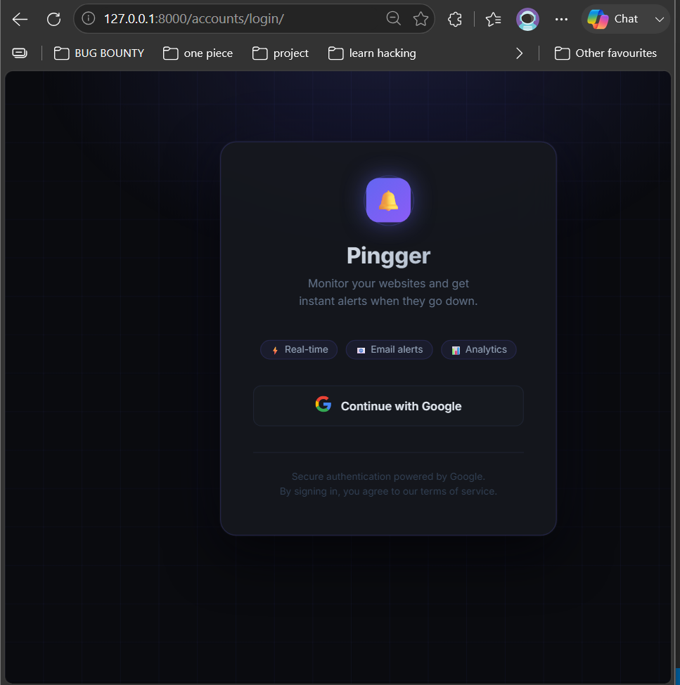
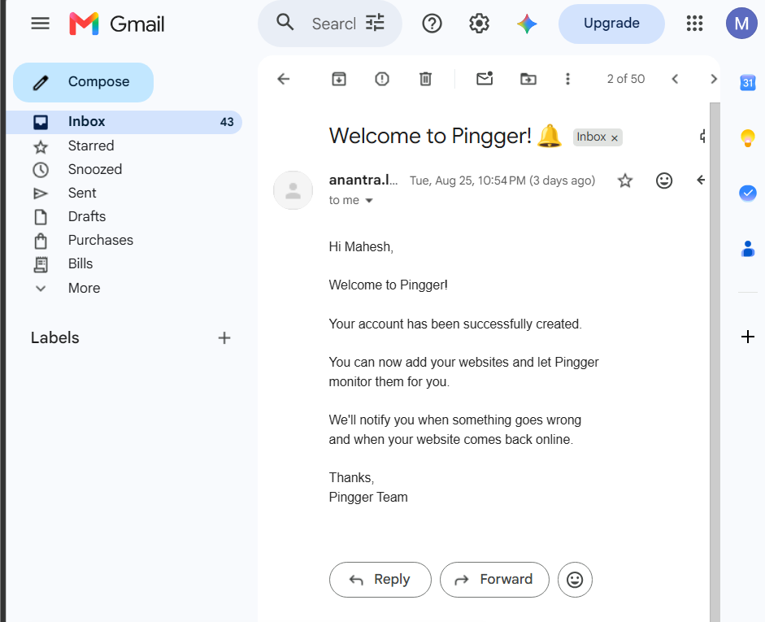
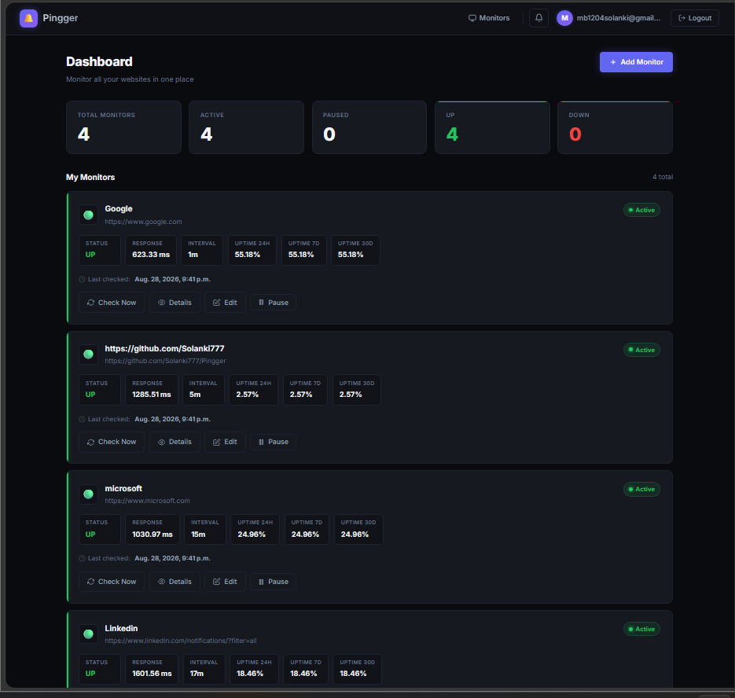
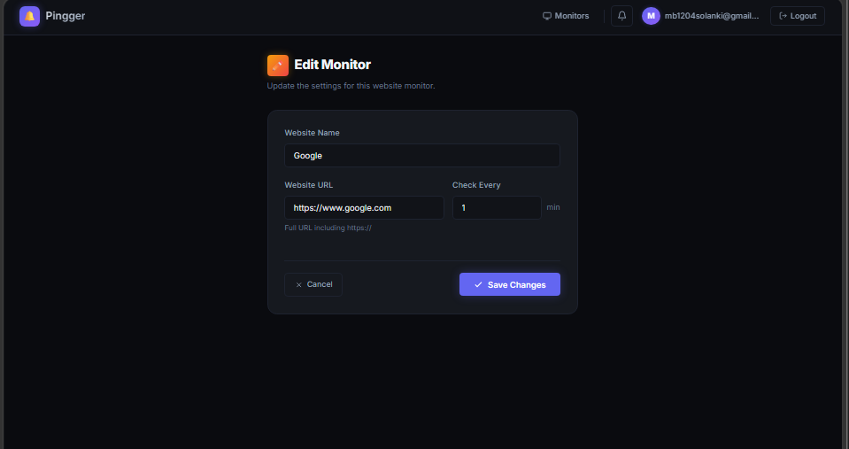
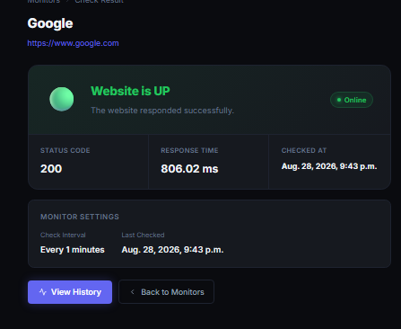
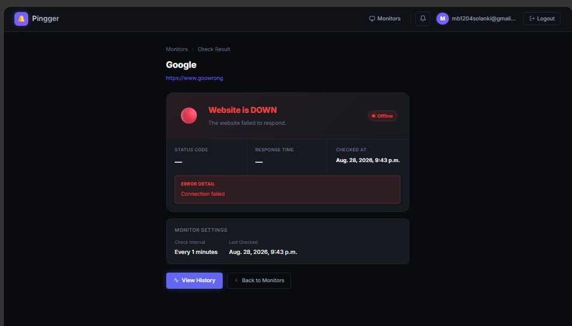
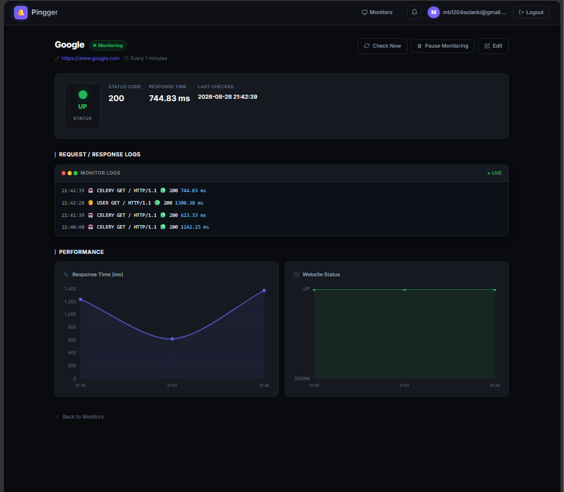
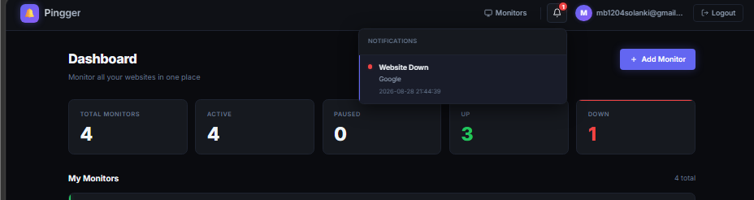
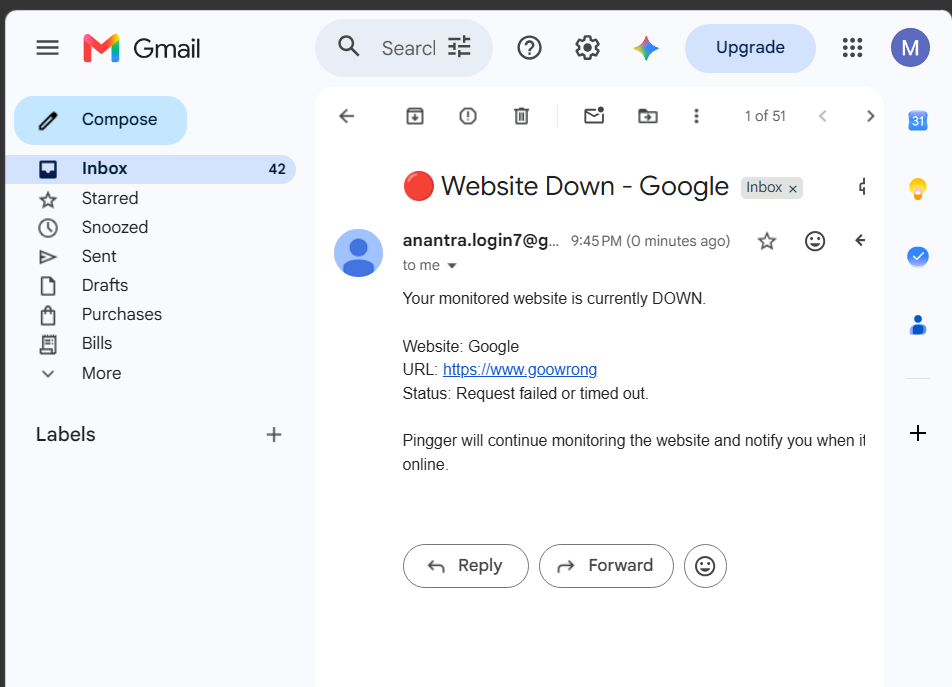
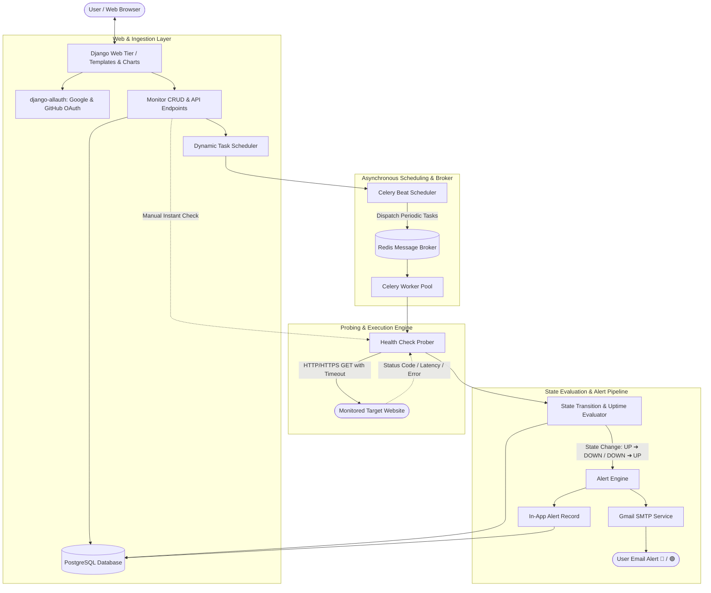

# 🏓 Pingger

> **Real-time website uptime monitoring** — built with Django, Celery, Redis, and PostgreSQL.

Pingger lets you track the health of any URL on a configurable schedule. It records response times, calculates uptime percentages, and instantly alerts you (in-app **and** via email) whenever a site goes down or comes back online.

---

## 🚀 Deployment Status

> ⚠️ **Currently not publicly deployed**
>
> Pingger has been fully developed and tested locally, including Google authentication, website monitoring, scheduled health checks, alerts, notifications, and email functionality.
>
> The application is **currently not deployed to a public production server because the selected free cloud hosting provider requires credit-card/payment verification**. Since a suitable payment method is not currently available, deployment has been temporarily paused.
>
> The project is fully functional in the local development environment, and screenshots of the working application are provided below.

---

## 🖥️ Working Application Screenshots

The following screenshots demonstrate the working Pingger application.

### 🔐 Google Login



### 📊 Monitoring Dashboard



### 🌐 Add or Save Website Monitor



### 🟢 Website Up



### 🔴 Website Down



### 📈 Monitoring Graph



### 🔔 Alerts & Notifications



### 📧 Email Notification



> These screenshots demonstrate the application's functionality running in the local development environment.

---

## ✨ Features

| Feature | Details |
|---|---|
| 🔍 **Health Checks** | HTTP GET checks with 10 s timeout; records status code & response time |
| ⏱ **Scheduled Monitoring** | Per-monitor intervals (minutes) powered by Celery Beat + `django-celery-beat` |
| 📊 **Uptime Calculation** | Accurate 24 h / 7 d / 30 d uptime % accounting for pause/resume state |
| 🔔 **Smart Alerts** | Fires only on state transitions (UP → DOWN and DOWN → UP) |
| 📧 **Email Notifications** | Gmail SMTP — "Website Down 🔴" and "Back Online 🟢" emails |
| 👤 **Auth** | Django-allauth with Google OAuth & GitHub OAuth support |
| 🗃 **Per-user isolation** | Every monitor, check, and alert is scoped to the owner |
| 🕹 **Manual checks** | Trigger an instant check from the dashboard at any time |
| ✏️ **Full CRUD** | Add, edit, pause/resume, and delete monitors |

## 🏗️ System Architecture

Pingger follows a decoupled, asynchronous, and event-driven architecture designed for high availability and non-blocking monitoring workflows. The platform cleanly separates synchronous user interactions from background distributed health checking and alert dispatching.

### Request Lifecycle & Orchestration

The core monitoring lifecycle is orchestrated through **Django**, **Celery Beat**, **Redis**, and **Celery Workers**:



### Architectural Highlights

1. **Dynamic Task Scheduling (`django-celery-beat`)**:
   - When a user creates, edits, or toggles a monitor, Django dynamically creates or updates `PeriodicTask` and `IntervalSchedule` records in the database.
   - Celery Beat monitors the database for schedule updates and dispatches execution tasks into the Redis queue at each monitor's configured interval.

2. **Distributed Asynchronous Worker Pool (`Celery + Redis`)**:
   - Celery workers consume tasks from Redis, performing outbound HTTP/HTTPS probes concurrently without blocking the main web server.
   - Outbound requests capture precise response times (ms), HTTP status codes, and handle connection errors/timeouts gracefully.

3. **Smart State Transition & Alert Suppression**:
   - The state engine compares the current check against the previous check state.
   - Alerts are triggered **only on actual state transitions** ($UP \rightarrow DOWN$ or $DOWN \rightarrow UP$), preventing alert fatigue and email spam while the site remains in a continuous state.

4. **Telemetry & Uptime Analytics Engine**:
   - Historical check records feed the uptime engine, which accurately calculates 24-hour, 7-day, and 30-day availability percentages while taking monitor pause/resume states (`MonitorState`) into account.

---

## 🛠 Tech Stack

| Layer | Technology |
|---|---|
| Web framework | Django 6 |
| Task queue | Celery 5 |
| Message broker / cache | Redis 8 |
| Task scheduler | Celery Beat + `django-celery-beat` |
| Database | PostgreSQL (via `psycopg` 3) |
| Authentication | `django-allauth` (Google & GitHub OAuth) |
| HTTP checks | `requests` |
| Email | Gmail SMTP |

---

## 📁 Project Structure

```text
Pingger/

├── config/                 # Django project settings
│   ├── settings.py        # Main settings (DB, Celery, email, allauth)
│   ├── celery.py          # Celery application instance
│   └── urls.py            # Root URL conf
│
├── monitor/               # Core monitoring app
│   ├── models.py          # Monitor, HealthCheck, MonitorState, Alert
│   ├── views.py           # All views (list, add, edit, delete, APIs)
│   ├── tasks.py           # Celery tasks
│   ├── services.py        # Health checks and uptime calculations
│   ├── signals.py         # Django signals
│   └── urls.py            # Monitor URL patterns
│
├── templates/             # HTML templates
├── screenshots/           # Working application screenshots
├── requirements.txt       # Python dependencies
├── manage.py
└── .env                   # Environment variables (not committed)